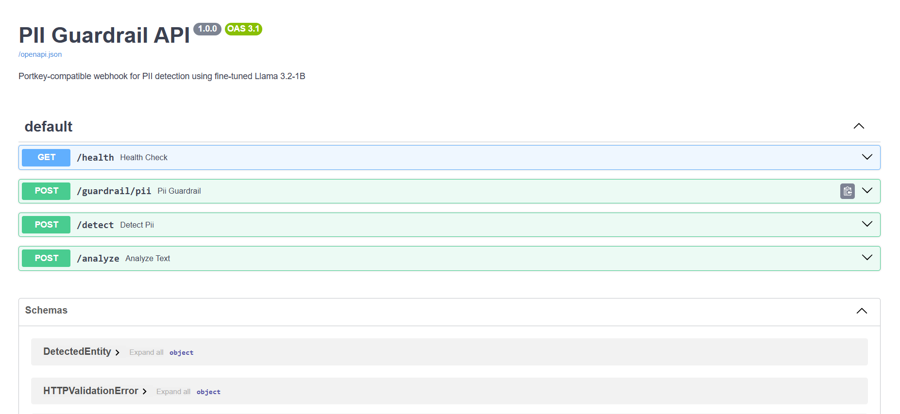

# PII Guardrail

Fine-tuned Llama 3.2-1B model for PII detection with FastAPI server and Portkey webhook integration.

## Architecture

```
┌─────────────────────────────────────────────────────────────────────────────┐
│                           PII GUARDRAIL SYSTEM                              │
├─────────────────────────────────────────────────────────────────────────────┤
│                                                                             │
│   ┌──────────────┐     ┌──────────────────┐     ┌─────────────────────┐    │
│   │   Portkey    │────▶│   FastAPI Server │────▶│  Llama 3.2-1B       │    │
│   │   Gateway    │     │   /guardrail/pii │     │  (Fine-tuned)       │    │
│   └──────────────┘     └──────────────────┘     └─────────────────────┘    │
│         │                      │                         │                  │
│         │                      ▼                         ▼                  │
│         │              ┌──────────────────┐     ┌─────────────────────┐    │
│         │              │  Pre-filter      │     │  Grounding          │    │
│         │              │  (Regex Scan)    │     │  Validation         │    │
│         │              └──────────────────┘     └─────────────────────┘    │
│         │                                                │                  │
│         ▼                                                ▼                  │
│   ┌──────────────────────────────────────────────────────────────────┐     │
│   │                        JSON Response                              │     │
│   │  { flagged, confidence, entities, reason, risk_level }           │     │
│   └──────────────────────────────────────────────────────────────────┘     │
│                                                                             │
└─────────────────────────────────────────────────────────────────────────────┘
```

## Quick Start

### 1. Install Dependencies

```bash
pip install -r requirements.txt
```

### 2. Configure Environment

```bash
cp env.example .env
# Edit .env with your MODEL_PATH
```

### 3. Run Server

```bash
python run_server.py
```

Server starts at `http://localhost:8000`

### 4. Test API

Open `http://localhost:8000/docs` for Swagger UI:



## API Endpoints

| Endpoint | Method | Description |
|----------|--------|-------------|
| `/health` | GET | Health check |
| `/guardrail/pii` | POST | Portkey webhook endpoint |
| `/detect` | POST | Direct PII detection |
| `/analyze` | POST | Flat response format |

## Request/Response

**Request:**
```json
{
  "text": "My email is john@example.com"
}
```

**Response:**
```json
{
  "flagged": true,
  "confidence": 9,
  "entities": [
    {
      "type": "EMAIL",
      "value": "john@example.com",
      "start": 12,
      "end": 28
    }
  ],
  "reason": "Detected email address",
  "risk_level": "HIGH"
}
```

## Risk Levels

| Level | Confidence | PII Types |
|-------|------------|-----------|
| HIGH | 9-10 | Email, Phone, Aadhaar, PAN, SSN, Credit Card |
| MEDIUM | 6-8 | Name + Location, Employee IDs |
| LOW | 1-5 | First name only, Public figures |

## Training (Google Colab)

1. Upload `data/train_v2.jsonl` and `data/eval_v2.jsonl` to Google Drive
2. Open `training/pii_guardrail.ipynb` in Colab
3. Run cells in order (1 → 9 for training, 18 for testing)
4. Download model from Drive

## Project Structure

```
├── api/
│   ├── main.py          # FastAPI application
│   ├── model.py         # Model loading & inference
│   └── schemas.py       # Pydantic models
├── data/
│   ├── train_v2.jsonl   # Training data
│   └── eval_v2.jsonl    # Evaluation data
├── training/
│   ├── pii_guardrail.ipynb      # Colab training notebook
│   └── generate_with_portkey.py # Data generation script
├── pii-guardrail-model/         # Fine-tuned model
├── run_server.py        # Server entry point
└── requirements.txt
```

## Portkey Integration

Set webhook URL in Portkey:
```
https://your-server.com/guardrail/pii
```

Use ngrok for local testing:
```bash
ngrok http 8000
```
